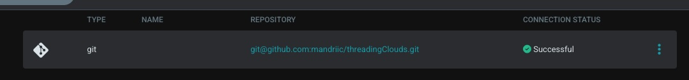

# Setting up CD/CI for a Java-Spring Application in a Kubernetes Cluster

This guide outlines the steps to implement Continuous Deployment (CD) and Continuous Integration (CI) for a simple Java-Spring application within a Kubernetes cluster. The CD/CI pipeline will be orchestrated using Git Actions, ArgoCD, and Docker images.


## Overview

This guide offers step-by-step instructions for creating a basic Spring application using Gradle. Follow these steps to establish your development environment, create a simple Spring project, and execute the application in Kubernetes cluster.  
With Git Actions, I'll automate the process of building a Docker image and uploading it to Docker Hub.  
I'll deploy it on my local machine using Kubernetes and Kind. With Argo CD, I'll monitor Git for changes to the Kubernetes cluster and Docker Hub for updates to the Spring project.  
The next part of the project is about setting up a monitoring system for Kubernetes and organizing everything using Terraform. This helps keep an eye on how things are going and makes it easier to manage the infrastructure as the project grows. It's like making sure everything is running smoothly and using a tool to easily control how things are set up.

## Prerequisites

Make sure you have the following installed on your machine:

- [Java Development Kit (JDK)](https://adoptopenjdk.net/)
- [Gradle](https://gradle.org/)
- [IDE](https://code.visualstudio.com/)

## Steps

### Step 1: Download a New Spring initializr (https://start.spring.io/)

1. Open your IDE and create a new Spring project.
2. Choose the appropriate Spring Initializer or Gradle archetype for your project. Include the necessary dependencies (e.g., Spring Boot, Spring Web).  

### Step 3: Build and Run the Project

1. Open the project in your IDE.
2. Build the project using Gradle:

   ```bash
   ./gradlew build
   
3. Your jar files will apeared in build folder.  

# Configure workflow for git acions

 - Create file [.github/workflows/main.yaml](.github/workflows/main.yaml) (Comments are inside)
   And lets, push our app into in this repo.

# Install Kubernetes Cluster in your local machine and kind

###  1 [ Install kubernetes in your local machine ](https://kubernetes.io/releases/download/)

###  2 [ Installing kind in your local machine ](https://kind.sigs.k8s.io/docs/user/quick-start/#installation)

Command `kind create cluster` will bootstrap a Kubernetes cluster using a pre-built node image. Prebuilt images are hosted atkindest/node, but to find images suitable for a given release currently you should check the release notes for your given kind version (check with kind version) where you’ll find a complete listing of images created for a kind release. Read [ MORE ](https://kind.sigs.k8s.io/docs/user/quick-start/#creating-a-cluster)  


# Install [ Argo CD ](https://argo-cd.readthedocs.io/en/stable/getting_started/)  
`kubectl create namespace argocd`  
`kubectl apply -n argocd -f https://raw.githubusercontent.com/argoproj/argo-cd/stable/manifests/install.yaml`  
This will create a new namespace, argocd, where Argo CD services and application resources will live. 
Now we can enter in UI of Argo CD ib browser. But before we need meka port forvarding from kubernetes `kubectl port-forward svc/argocd-server -n argocd 8081:443`, for acces https://localhost:8081  
**NOTE**: You can recieve error "error: unable to forward port because pod is not running. Current status=Pending", is because pod of argo is creating now, wait some minutes.  
**NOTE2**: For access you will need password (login is admin), you can get it with argo CLI, or con command `kubectl -n argocd get secret argocd-initial-admin-secret -o jsonpath="{.data.password}" | base64 -d`  

# Creating configutration for argocd
First we need connect our git repository. (Settings -> Connect repo)
For ssh conenction we need create RSA pair, `ssh-keygen` [ MORE ](https://www.ssh.com/academy/ssh/keygen) and paste private key in window "SSH private key data", and public key you need to paste in github repository [ MORE ](https://docs.github.com/en/authentication/connecting-to-github-with-ssh/adding-a-new-ssh-key-to-your-github-account)  


In repository url `git@github.com:my_login/my_repo.git`
After you will see connection status "Successful" if not, check configuration.

In github repository we need to create directory where we will save configs for Argo CD. In my repo its name is `k8s`.
[ HERE ](k8s/java-app.yaml) config file of Java-app which will check Docker image:tag an create new pods in kubernetes cluster, when it changed. Argo CD will check this file for changes.

When I push changes in repo, git Actions change tag of docker image in this file with HASH of commit.  
Now let's create new app in Argo CD:
NEW APP -> check config and chose what you need. Important is chose source of your git repo, an path where Argo CD need's to check config files.
In path you need to paste directory in your repo, where you will save .yaml files of kubernetes.
  
If all is good, you will see next:


For forward ports I use `while true; do kubectl port-forward deployments/java-app-deployment -n default 8082:8080; done`, It works but not perfect, I tryed make it based in kubernetes force, but now it dont work.  
